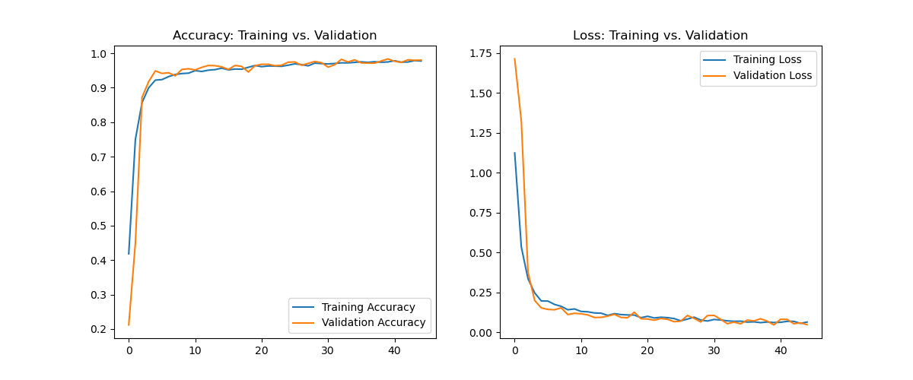

# Human Activity Recognition (HAR) Using Hybrid CNN-LSTM Model

## About the Dataset
The Human Activity Recognition (HAR) dataset was compiled from recordings of 30 participants performing activities of daily living (ADL) while wearing a waist-mounted smartphone with embedded inertial sensors. The goal is to classify these activities into one of six categories.

### Dataset Details
- **Participants**: 30 volunteers aged between 19 and 48 years.
- **Activities**: Six activities including WALKING, WALKING_UPSTAIRS, WALKING_DOWNSTAIRS, SITTING, STANDING, and LAYING.
- **Sensors**: Accelerometer and Gyroscope capturing 3-axial linear acceleration and 3-axial angular velocity at a constant rate of 50Hz.
- **Data Collection**: The smartphone used was a Samsung Galaxy S II. The sensor signals were pre-processed by applying noise filters and then sampled in fixed-width sliding windows of 2.56 sec with 50% overlap (128 readings/window).

## Experiment Description
The experiment involved recording the six different activities performed by the volunteers using the smartphone's sensors. The recorded data was manually labeled based on video recordings of the activities. The dataset was randomly partitioned into two sets: 70% for training and 30% for testing.

### Data Preprocessing
- **Noise Filtering**: Applied to sensor signals before sampling.
- **Sampling**: Fixed-width sliding windows of 2.56 sec and 50% overlap.
- **Feature Extraction**: From each window, a vector of features was obtained by calculating variables from the time and frequency domain.

## Exploratory Data Analysis (EDA) 
The `har_base_eda.py` script is designed to perform initial exploratory data analysis on the HAR dataset. This script provides insights into the basic properties of the data, the distribution of activities among participants, and the sensor data utilization.

### Key Features
- **Data Loading**: Automated loading of CSV files from a specified directory.
- **Basic Data Insights**: Outputs the shape, head, data types, and descriptive statistics of the training and test datasets.
- **Activity Counts**: Displays the number of samples for each activity.
- **Visualizations**: Includes several plots to understand the data distribution, such as sensor data usage, user activity distribution, and sensor value distributions by activity.

## Model Description
The model is a hybrid CNN-LSTM architecture enhanced with an attention mechanism. This architecture aims to leverage both the spatial feature extraction capabilities of CNNs and the temporal sequence processing ability of LSTMs, making it well-suited for time-series data like the HAR dataset.

### Model Architecture
- **CNN Layers**: For initial feature extraction from the time-series data.
- **Attention Mechanism**: To focus on the most relevant features for activity classification.
- **LSTM Layer**: For capturing long-term dependencies in the time-series data.
- **Output Layer**: A softmax layer for classifying the activities into six categories.

## Results

### Training Insights
Throughout the training process, we monitored both the loss and accuracy metrics to evaluate the model's learning progress. The following graph illustrates how the model's performance evolved over epochs:

### Evaluation Metrics
Upon completion of the training, the model was subjected to rigorous evaluation, yielding impressive results:
- **Accuracy on Validation Set**: Achieved a high accuracy of 97.76%, indicating the model's robustness in generalizing to unseen data within the validation set.
- **Accuracy on Test Set**: Demonstrated a commendable accuracy of 94.98%, further solidifying the model's capability to accurately predict activity classes on completely new and unseen data.

### Confusion Matrix
Confusion matrices for validation and testing datasets provide insights into the model's performance across different activities.

## References
- [Human Activity Recognition with Smartphones Dataset on Kaggle](https://www.kaggle.com/datasets/uciml/human-activity-recognition-with-smartphones)
- Various Kaggle notebooks demonstrating similar analyses and models for HAR.

